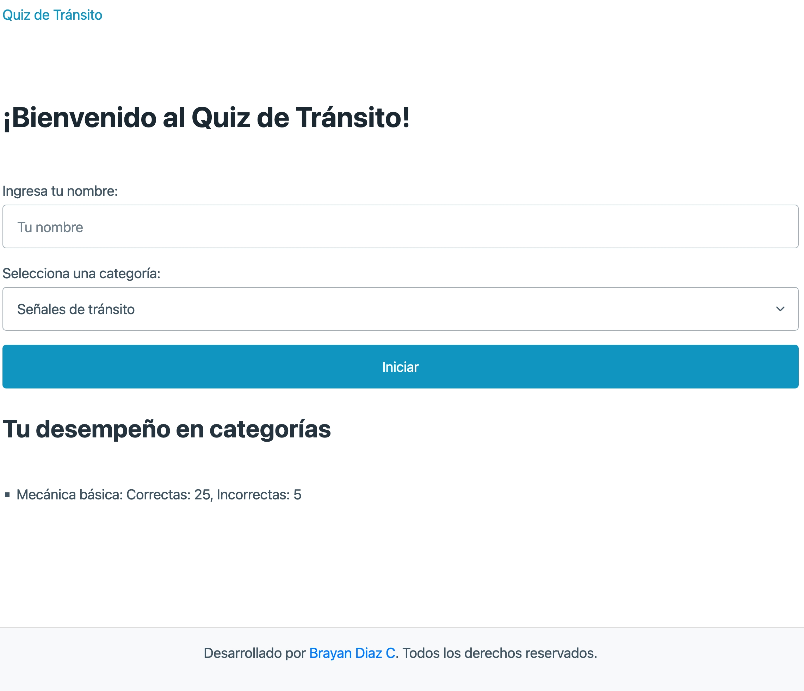
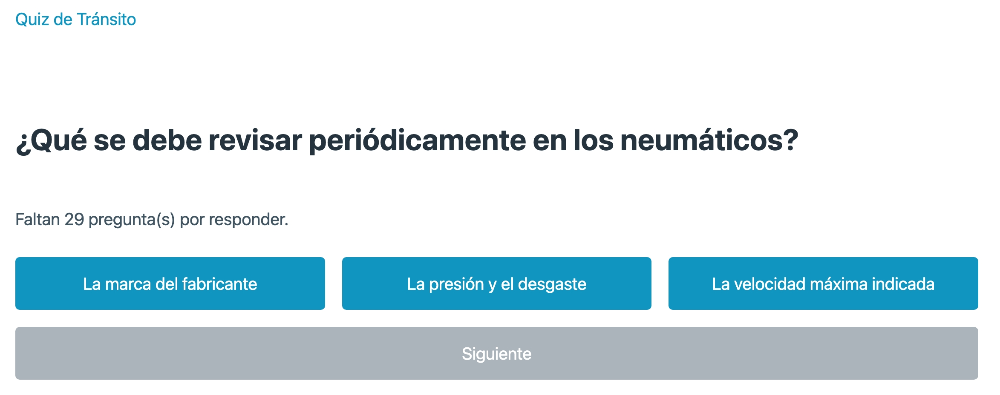

# Quiz de Tránsito

**Quiz de Tránsito** es una aplicación interactiva que permite a los usuarios evaluar sus conocimientos sobre señales de tránsito, normas de conducción, seguridad vial, mecánica básica y sanciones. Diseñada para aprendizaje dinámico, muestra estadísticas de desempeño y ayuda a reforzar áreas específicas.

## Descripción del proyecto

Este proyecto es un cuestionario interactivo que:

- Presenta preguntas en categorías clave relacionadas con el tránsito.
- Muestra las respuestas correctas e incorrectas al finalizar cada quiz.
- Almacena estadísticas de desempeño por categoría usando `localStorage`.
- Permite a los usuarios elegir qué categoría reforzar, basado en su desempeño anterior.

## Capturas de Pantalla del Proyecto

### Vista principal:



### Pantalla de cuestionario:



### Resultados:


## Prerrequisitos o Dependencias

Para ejecutar el proyecto localmente, necesitas lo siguiente:

- **Navegador web moderno** (Google Chrome, Firefox, Edge).
- **Editor de texto** (Visual Studio Code, Sublime Text, etc.).
- **Servidor web local** (opcional para cargar datos JSON, como `Live Server` en VS Code).

## Instalación del Proyecto

1. **Clona este repositorio:**

   ```bash
   git clone https://github.com/tuusuario/quiz-transito.git
   cd quiz-transito
   ```

2. **Estructura de carpetas:**
   Asegúrate de que la estructura del proyecto esté organizada como sigue:

   ```
   project-folder/
   ├── index.html
   ├── app.js
   ├── data/
   │   ├── questions_signals.json
   │   ├── questions_norms.json
   │   ├── questions_safety.json
   │   ├── questions_mechanics.json
   │   ├── questions_penalties.json
   ├── assets/
   │   ├── css/
   │   │   └── style.css
   │   ├── imagenes/
   │       └── (capturas de pantalla del proyecto)
   ```

3. **Inicia un servidor local (opcional):**
   Si necesitas cargar los archivos JSON desde `data/`, inicia un servidor local:

   ```bash
   # Instala un servidor estático simple (si no tienes Live Server)
   npm install -g serve

   # Inicia el servidor
   serve .
   ```

## Instrucciones para Ejecutar el Proyecto

1. Abre `index.html` en tu navegador web directamente o a través de un servidor local.
2. Introduce tu nombre y selecciona una categoría para comenzar el quiz.

## Instrucciones para Cargar la Base de Datos o Migrar los Modelos

No es necesario realizar migraciones o configuraciones de bases de datos. Las preguntas se encuentran en archivos JSON dentro de la carpeta `data/`.

## Instrucciones para Cargar los Datos Semilla a la Base de Datos

Si actualizas las preguntas, edita los archivos JSON en la carpeta `data/`. Aquí hay un ejemplo de estructura para las preguntas:

```json
[
  {
    "id": 1,
    "question": "¿Qué indica una señal de tránsito con borde rojo y fondo blanco?",
    "options": ["Advertencia", "Prohibición", "Información"],
    "answer": "Prohibición"
  }
]
```

## Credenciales de Acceso

No se requiere autenticación para usar la aplicación.

## Autor

- [Brayan Diaz C](https://github.com/brayandiazc)

## Licencia

Este proyecto está bajo la Licencia MIT - ve el archivo [LICENSE.md](LICENSE) para detalles.

## Consejos Adicionales

1. **Pruebas locales:** Usa un servidor como `Live Server` para evitar problemas al cargar los archivos JSON.
2. **Actualización de preguntas:** Edita los archivos en la carpeta `data/` según sea necesario.
3. **Estilo adicional:** Personaliza el archivo `style.css` en la carpeta `assets/css` para agregar tu toque único.

⌨️ con ❤️ por [Brayan Diaz C](https://github.com/brayandiazc) 😊
